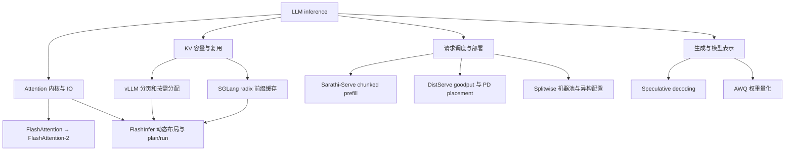

# LLM Inference

研究问题是：在指定模型、硬件、精度、请求分布和延迟要求下，如何减少生成成本并提高可用吞吐？先分清 **计算、数据搬运、KV 容量、跨请求复用、排队与调度**，再选择技术。页内结论来自2026-09-14归档的固定论文版本，不代表当前项目的实时性能排行。

## 本次收录

10篇核心论文均已下载 TeX/PDF；vLLM 与 SGLang 完成主文/附录阅读，其余为方法与实验的定向阅读，metadata 明确为 partial。8个官方 Git 仓库有本地缓存与 commit；没有运行 GPU、模型或论文 benchmark。每篇资产位于 `assets/<slug>/`，采用 llmwiki skill 的规范布局。两代 FlashAttention 共享官方代码缓存，不复制第二份。

| 主线 | 论文 / 本地笔记 | 证据版本 | 阅读状态 | 优先级 |
|---|---|---|---|---|
| IO-aware attention | [[research/llm-inference/assets/flashattention-2022/index|flashattention-2022]] | 2205.14135v2 | partial | P0 |
| GPU work partitioning | [[research/llm-inference/assets/flashattention-2-2023/index|flashattention-2-2023]] | 2307.08691v1 | partial | P1 |
| KV 分页与 batching | [[research/llm-inference/assets/vllm-2023/index|vllm-2023]] | 2309.06180v1 | read | P0 |
| 多调用 prefix reuse | [[research/llm-inference/assets/sglang-2024/index|sglang-2024]] | 2312.07104v2 | read | P0 |
| chunked prefill / TBT | [[research/llm-inference/assets/sarathi-serve-2024/index|sarathi-serve-2024]] | 2403.02310v3 | partial | P0 |
| PD 分离 / goodput | [[research/llm-inference/assets/distserve-2024/index|distserve-2024]] | 2401.09670v3 | partial | P1 |
| 异构集群 / phase splitting | [[research/llm-inference/assets/splitwise-2024/index|splitwise-2024]] | 2311.18677v2 | partial | P1 |
| draft / verify | [[research/llm-inference/assets/speculative-decoding-2023/index|speculative-decoding-2023]] | 2211.17192v2 | partial | P1 |
| W4A16 / 端侧 decode | [[research/llm-inference/assets/awq-2024/index|awq-2024]] | 2306.00978v6 | partial | P1 |
| 动态 attention engine | [[research/llm-inference/assets/flashinfer-2025/index|flashinfer-2025]] | 2501.01005v2 | partial | P0 |

## 机制地图

## 容易混淆的概念

| 技术 | 主要改变什么 | 不应据此推断什么 |
|---|---|---|
| FlashAttention | score/probability 暂存和 HBM IO | dense attention 的 FLOPs 变成线性，或持久 KV 消失 |
| PagedAttention | KV 逻辑块到物理块映射，减少碎片 | KV 数值本体被压缩，或单 kernel 必然更快 |
| RadixAttention | 已完成请求的前缀 KV 保留、匹配、复用 | 语义相似文本可直接复用 KV，或最长前缀调度在线总最优 |
| Chunked prefill | 每步 prefill token budget 与混合调度 | 任意负载下 TTFT/TBT 都下降，或 chunking 无额外 IO |
| PD disaggregation | prefill/decode 分别配资源与并行方式 | 单卡也受益、KV transfer 免费或 cost 总更低 |
| Speculative decoding | draft 提议 + target 验证，减少串行轮数 | 总 FLOPs 一定下降、相同随机种子输出逐字一致 |
| AWQ | 权重低比特表示及 scaling | KV 也被量化、所有任务严格无损 |

同一模型的 KV 复用要求前缀 token 与影响 forward 的配置相容；position、模型/adapter、cache namespace 等需要正确处理。这里讨论的是推理中间状态，和 [[research/agent-memory/index|agent 长期记忆]] 的语义条目是不同对象。

## 对照实验协议

先报告模型/版本、量化方式、attention 类型（MHA/GQA/MQA/MLA）、硬件/互联、输入输出长度分布、arrival process、concurrency、prefix 命中率、sampling 配置、软件 commit。

| 层级 | 应报告的量 | 典型陷阱 |
|---|---|---|
| Attention kernel | latency、有效带宽/FLOPs、shape、layout、causal mask | 将 kernel speedup 直接宣称 E2E speedup |
| 模型 forward / 单请求 | prefill latency、TTFT、各 token ITL/TBT、输出长度 | 只测短 prompt 却推广长上下文 |
| 在线服务 | TTFT/ITL 分位数、E2E latency、请求率、SLO goodput、排队/拒绝率 | 把 normalized latency 均值当 P99 ITL |
| 集群配置 | 固定成本/功耗/吞吐约束、GPU数、KV通信、负载均衡 | 将模拟配置收益当硬件集群实测 |
| 量化与 speculation | 质量/分布条件、draft接受率及开销、真实低比特kernel | 把模型压缩率当延迟加速比 |

FP16 MHA 的 KV 容量近似为 `2 × layers × tokens × kv_heads × head_dim × bytes_per_element`；batch 多序列需累加，prefix sharing 可消除重复，分页仍有尾块开销。GQA/MQA 要用 KV heads 而非 Q heads；MLA 的 latent cache 另算。权重读与 KV 读谁主导取决于 batch、context 和模型，不能统一称“decode 总是只受权重带宽限制”。

比较 SGLang 与 vLLM 时，原始论文用于理解机制，当前项目选型必须重新固定软件版本与开关；SGLang论文的6.4×不是今天的普遍结论。DistServe、Splitwise、Sarathi-Serve是不同部署约束下的可选方案，其收益不可简单累乘。

## 阅读路径与补充线索

优先顺序：FlashAttention → vLLM → SGLang → Sarathi-Serve → FlashInfer，再根据目标加入 DistServe/Splitwise（集群）、AWQ（端侧）和 speculative decoding（延迟）。

以下为下一轮候选，**尚未按本次流程完整归档或核验**，不计入10篇下载总数：

- Orca（OSDI 2022）：iteration-level scheduling；vLLM 的 related work 已确认其历史位置。
- FasterTransformer / TensorRT-LLM：优先做工程来源笔记；项目与论文不能混为一谈。
- FlexGen/FlexLLMGen、DeepSpeed Inference、GPTQ、SmoothQuant：offload、分布式推理和量化补充。
- MQA/GQA、FlashAttention-3、FlashDecoding、FlashDecoding++、Lean Attention：decode/新硬件内核补充。
- SpecInfer、Medusa、EAGLE：speculation 后续，需区分训练需求和分布保持条件。
- H2O、StreamingLLM、KIVI、KVQuant、SnapKV：KV compression/eviction，需同时检查精度与实现开销。
- 2025–2026新论文需要更可靠的增量检索；本轮 API 覆盖失败较多，不声称最新领域全景。

## 检索和相关区域

- [[research/llm-inference/threads/2026-09-14-paper-search]]：全部21条 API结果、9条追加召回、统计、原始错误和选文理由。
- 入库时已完成格式、哈希、路径、Git commit 与链接检查；历史校验中间文件已清理。上述检查不证明科学结论或实验复现。
- [[research/fpga-llm-inference/index]]：可借鉴内存/调度机制，但 GPU 特定 kernel 性能不能直接移植为 FPGA 优势。
- [[research/linear-attention/index]]：改 attention 运算形式的另一条路线；与 exact dense attention 优化分开评估。
- [[research/lora-training-opt/index]]：FlashAttention 内核也影响训练，但训练与服务指标不同。
- [[research/index]]；[[index]]。
