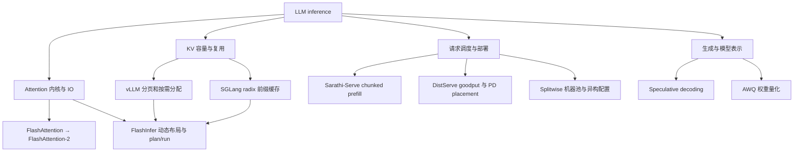

# LLM Inference

研究问题是：在指定模型、硬件、精度、请求分布和延迟要求下，如何减少生成成本并提高可用吞吐？先分清 **计算、数据搬运、KV 容量、跨请求复用、排队与调度**，再选择技术。机制部分来自2026-09-14归档的固定论文版本；2026-10-01增量另列当前工程检索与g4090实测，均不代表未测配置的性能排行。

## 2026-09-14 核心论文归档

10篇核心论文均已下载 TeX/PDF；vLLM 与 SGLang 完成主文/附录阅读，其余为方法与实验的定向阅读，阅读记录明确为 partial。8个官方 Git 仓库有本地缓存与 commit；该批论文归档没有运行 GPU、模型或论文 benchmark。每篇资产位于 `assets/<slug>/`，采用 llmwiki skill 的规范布局。两代 FlashAttention 共享官方代码缓存，不复制第二份。

| 主线 | 论文 / 本地笔记 | 证据版本 | 阅读状态 | 优先级 |
|---|---|---|---|---|
| IO-aware attention | [[research/llm-inference/assets/flashattention-2022/note|flashattention-2022]] | 2205.14135v2 | partial | P0 |
| GPU work partitioning | [[research/llm-inference/assets/flashattention-2-2023/note|flashattention-2-2023]] | 2307.08691v1 | partial | P1 |
| KV 分页与 batching | [[research/llm-inference/assets/vllm-2023/note|vllm-2023]] | 2309.06180v1 | read | P0 |
| 多调用 prefix reuse | [[research/llm-inference/assets/sglang-2024/note|sglang-2024]] | 2312.07104v2 | read | P0 |
| chunked prefill / TBT | [[research/llm-inference/assets/sarathi-serve-2024/note|sarathi-serve-2024]] | 2403.02310v3 | partial | P0 |
| PD 分离 / goodput | [[research/llm-inference/assets/distserve-2024/note|distserve-2024]] | 2401.09670v3 | partial | P1 |
| 异构集群 / phase splitting | [[research/llm-inference/assets/splitwise-2024/note|splitwise-2024]] | 2311.18677v2 | partial | P1 |
| draft / verify | [[research/llm-inference/assets/speculative-decoding-2023/note|speculative-decoding-2023]] | 2211.17192v2 | partial | P1 |
| W4A16 / 端侧 decode | [[research/llm-inference/assets/awq-2024/note|awq-2024]] | 2306.00978v6 | partial | P1 |
| 动态 attention engine | [[research/llm-inference/assets/flashinfer-2025/note|flashinfer-2025]] | 2501.01005v2 | partial | P0 |

## Qwen3.8-27B / RTX 4090（2026-10-01 增量）

官方模型确实为 `Qwen/Qwen3.8-27B`，架构沿用 `qwen3_5`：48 层 Gated DeltaNet + 16 层 full attention，含 MTP。当前增量围绕 24GB 消费卡、单请求 decode 与可复现部署；公开速度与 g4090 实测分开记录。

- [[research/llm-inference/threads/2026-10-01-qwen38-4090-landscape]]：工程、博客、模型资产的广泛长名单，关注度、硬件支持、筛选依据与作者速度。
- [[research/llm-inference/threads/2026-10-01-qwen38-4090-paper-search]]：ResearchStudio-Idea + installed paper-search + primary web 补召回，140 条合并结果及原始错误。
- [[research/llm-inference/threads/2026-10-01-g4090-qwen38-speed]]：模型/engine 固定版本、实际启动、token/s、输出检查与部署命令。
- [[research/llm-inference/threads/2026-10-01-g4090-agent-tools]]：Claude Code、Codex、OpenCode、CC Switch 在 g4090 的安装与验证。

| 可复现工程证据 | 取舍 |
|---|---|
| [[research/llm-inference/assets/cinference-4090-2026/note|Cinference 4090]] | 精确 4090 公开矩阵与 raw data；固定 draft K 依赖负载 |
| [[research/llm-inference/assets/ninfer-4090-2026/note|NInfer 4090]] | Ada 分支、MTP、长 context；须匹配 v2/v3 artifact |
| [[research/llm-inference/assets/ninfer-all-2026/note|NInfer All]] | CUDA 12.8+、多消费卡架构、DFlash2；社区关注较少 |
| [[research/llm-inference/assets/exllamav3-2026/note|ExLlamaV3 + DFlash2]] | EXL3 quants 与 native draft 支持；源码/PyTorch/CUDA ABI 需匹配 |
| [[research/llm-inference/assets/hyperqwen-2026/note|HyperQwen]] | 受关注的 vLLM 配置 kit；当前 CUDA 13 依赖与 g4090 不直接匹配 |
| [[research/llm-inference/assets/llama-cpp-2026/note|llama.cpp]] | GGUF 基线、MTP/DFlash2、易部署；比较精度/缓存/版本 |
| [[research/llm-inference/assets/ik-llama-cpp-2026/note|ik_llama.cpp]] | CPU/GPU/量化工程优化；先核验 exact model/speculation 支持 |
| [[research/llm-inference/assets/beellama-cpp-2026/note|BeeLlama.cpp]] | GGUF 新分支与 Ada 优化；较小社区，保留原始条件 |
| [[research/llm-inference/assets/tokenspeed-2026/note|TokenSpeed]] | 官方 Qwen 列入支持；公开高端卡结果不等于单 4090 量化支持 |
| [[research/llm-inference/assets/ninfer-4090-windows-2026/note|NInfer Windows 4090]] | 公开速度线索；操作系统/分支不同，不能外推 Linux |

新增论文为方法与实现的定向阅读，阅读记录均标记 partial；没有把论文阅读或仓库缓存称为论文 benchmark 复现：[[research/llm-inference/assets/gptq-2023/note|GPTQ]]、[[research/llm-inference/assets/marlin-2024/note|Marlin]]、[[research/llm-inference/assets/qtip-2024/note|QTIP]]、[[research/llm-inference/assets/eagle-3-2025/note|EAGLE-3]]、[[research/llm-inference/assets/dflash-2026/note|DFlash]]。[[research/llm-inference/threads/qwen38-4090-paper-search-2026|全部原始检索日志]]。

## 机制地图

```mermaid
flowchart TD
  A[LLM inference] --> B[Attention 内核与 IO]
  A --> C[KV 容量与复用]
  A --> D[请求调度与部署]
  A --> E[生成与模型表示]
  B --> B1[FlashAttention → FlashAttention-2]
  B --> B2[FlashInfer 动态布局与 plan/run]
  C --> C1[vLLM 分页和按需分配]
  C --> C2[SGLang radix 前缀缓存]
  D --> D1[Sarathi-Serve chunked prefill]
  D --> D2[DistServe goodput 与 PD placement]
  D --> D3[Splitwise 机器池与异构配置]
  E --> E1[Speculative decoding]
  E --> E2[AWQ 权重量化]
  C1 --> B2
  C2 --> B2
```

## 容易混淆的概念

| 技术 | 主要改变什么 | 不应据此推断什么 |
|---|---|---|
| FlashAttention | score/probability 暂存和 HBM IO | dense attention 的 FLOPs 变成线性，或持久 KV 消失 |
| PagedAttention | KV 逻辑块到物理块映射，减少碎片 | KV 数值本体被压缩，或单 kernel 必然更快 |
| RadixAttention | 已完成请求的前缀 KV 保留、匹配、复用 | 语义相似文本可直接复用 KV，或最长前缀调度在线总最优 |
| Chunked prefill | 每步 prefill token budget 与混合调度 | 任意负载下 TTFT/TBT 都下降，或 chunking 无额外 IO |
| PD disaggregation | prefill/decode 分别配资源与并行方式 | 单卡也受益、KV transfer 免费或 cost 总更低 |
| Speculative decoding | draft 提议 + target 验证，减少串行轮数 | 总 FLOPs 一定下降、相同随机种子输出逐字一致 |
| AWQ | 权重低比特表示及 scaling | KV 也被量化、所有任务严格无损 |

同一模型的 KV 复用要求前缀 token 与影响 forward 的配置相容；position、模型/adapter、cache namespace 等需要正确处理。这里讨论的是推理中间状态，和 [[research/agent-memory/index|agent 长期记忆]] 的语义条目是不同对象。

## 对照实验协议

先报告模型/版本、量化方式、attention 类型（MHA/GQA/MQA/MLA）、硬件/互联、输入输出长度分布、arrival process、concurrency、prefix 命中率、sampling 配置、软件 commit。

| 层级 | 应报告的量 | 典型陷阱 |
|---|---|---|
| Attention kernel | latency、有效带宽/FLOPs、shape、layout、causal mask | 将 kernel speedup 直接宣称 E2E speedup |
| 模型 forward / 单请求 | prefill latency、TTFT、各 token ITL/TBT、输出长度 | 只测短 prompt 却推广长上下文 |
| 在线服务 | TTFT/ITL 分位数、E2E latency、请求率、SLO goodput、排队/拒绝率 | 把 normalized latency 均值当 P99 ITL |
| 集群配置 | 固定成本/功耗/吞吐约束、GPU数、KV通信、负载均衡 | 将模拟配置收益当硬件集群实测 |
| 量化与 speculation | 质量/分布条件、draft接受率及开销、真实低比特kernel | 把模型压缩率当延迟加速比 |

FP16 MHA 的 KV 容量近似为 `2 × layers × tokens × kv_heads × head_dim × bytes_per_element`；batch 多序列需累加，prefix sharing 可消除重复，分页仍有尾块开销。GQA/MQA 要用 KV heads 而非 Q heads；MLA 的 latent cache 另算。权重读与 KV 读谁主导取决于 batch、context 和模型，不能统一称“decode 总是只受权重带宽限制”。

比较 SGLang 与 vLLM 时，原始论文用于理解机制，当前项目选型必须重新固定软件版本与开关；SGLang论文的6.4×不是今天的普遍结论。DistServe、Splitwise、Sarathi-Serve是不同部署约束下的可选方案，其收益不可简单累乘。

## 阅读路径与补充线索

优先顺序：FlashAttention → vLLM → SGLang → Sarathi-Serve → FlashInfer，再根据目标加入 DistServe/Splitwise（集群）、AWQ（端侧）和 speculative decoding（延迟）。

以下为下一轮候选，**尚未按本次流程完整归档或核验**，不计入10篇下载总数：

- Orca（OSDI 2022）：iteration-level scheduling；vLLM 的 related work 已确认其历史位置。
- FasterTransformer / TensorRT-LLM：优先做工程来源笔记；项目与论文不能混为一谈。
- FlexGen/FlexLLMGen、DeepSpeed Inference、GPTQ、SmoothQuant：offload、分布式推理和量化补充。
- MQA/GQA、FlashAttention-3、FlashDecoding、FlashDecoding++、Lean Attention：decode/新硬件内核补充。
- SpecInfer、Medusa、EAGLE：speculation 后续，需区分训练需求和分布保持条件。
- H2O、StreamingLLM、KIVI、KVQuant、SnapKV：KV compression/eviction，需同时检查精度与实现开销。
- 2025–2026新论文需要更可靠的增量检索；本轮 API 覆盖失败较多，不声称最新领域全景。

## 检索和相关区域

- [[research/llm-inference/threads/2026-09-14-paper-search]]：全部21条 API结果、9条追加召回、统计、原始错误和选文理由。
- 入库时已完成格式、哈希、路径、Git commit 与链接检查；历史校验中间文件已清理。上述检查不证明科学结论或实验复现。
- [[research/fpga-llm-inference/index]]：可借鉴内存/调度机制，但 GPU 特定 kernel 性能不能直接移植为 FPGA 优势。
- [[research/linear-attention/index]]：改 attention 运算形式的另一条路线；与 exact dense attention 优化分开评估。
- LoRA Training Opt（原目录已移除）：FlashAttention 内核也影响训练，但训练与服务指标不同。
- [[research/index]]；[[index]]。

- [[research/llm-inference/threads/archive-migration-2026-10-09]]：迁移范围、预先删除资产与当前缺失证据；历史结果未重新复核。
